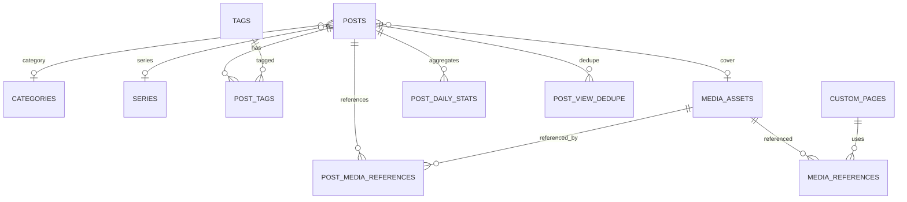

# Database Design

PostgreSQL + EF Core.

## ER overview



## Posts

Suggested fields:

```text
Id                    uuid PK
Title                 varchar/not null
Slug                  varchar/not null unique
Description           text nullable
ContentMarkdown       text not null
EditingContentMarkdown text nullable
SearchText            text not null/default ''
CoverMediaId          uuid nullable FK MediaAssets
CategoryId            uuid nullable FK Categories
SeriesId              uuid nullable FK Series
SeriesOrder           int nullable
Status                smallint/not null
IsPinned              bool/not null default false
SeoTitle              text nullable
SeoDescription        text nullable
CreatedAt             timestamptz not null
UpdatedAt             timestamptz not null
PublishedAt           timestamptz nullable
DeletedAt             timestamptz nullable
PurgeAt               timestamptz nullable
ViewCount             bigint not null default 0
```

Constraints/rules:

- slug unique among non-purged posts; simplest v1 implementation may keep global unique forever until hard delete.
- `PublishedAt` becomes non-null on first transition to Published and is never client-editable.
- Draft/Private must not appear in anonymous public queries.
- soft-deleted records are excluded by default query filter but must be queryable from Trash admin use cases.
- `PurgeAt = DeletedAt + 30 days`.

Indexes:

- unique `Slug`
- `(Status, PublishedAt DESC)`
- `(IsPinned, PublishedAt DESC)` where useful
- `CategoryId`
- `SeriesId`
- `DeletedAt/PurgeAt`
- search indexes described in search document

## Categories

```text
Id uuid PK
Name text not null
Slug text not null unique
CreatedAt
UpdatedAt
```

Deleting sets `Posts.CategoryId = null`.

## Tags

```text
Id uuid PK
Name text not null
Slug text not null unique
CreatedAt
UpdatedAt
```

## PostTags

Composite PK `(PostId, TagId)`.

Delete tag cascades association rows, not posts.

## Series

```text
Id uuid PK
Title text not null
Slug text unique not null
Description text nullable
Status smallint                 # ongoing/completed
DefaultCategoryId uuid nullable
CreatedAt
UpdatedAt
```

Deleting series sets `Posts.SeriesId = null`.

## MediaAssets

```text
Id uuid PK
Kind smallint                   # Image / Attachment
OriginalFileName text not null
StorageName text not null
OriginalPath text not null
OptimizedPath text nullable
ThumbnailPath text nullable
MimeType text not null
SizeBytes bigint not null
Width int nullable
Height int nullable
AltText text nullable
Sha256 text nullable
CreatedAt timestamptz not null
```

Do not trust user-supplied paths. Paths are generated by the server.

## PostMediaReferences

```text
PostId uuid
MediaAssetId uuid
ReferenceKind smallint          # Cover / Body / Attachment
PRIMARY KEY (PostId, MediaAssetId, ReferenceKind)
```

Refresh after article save/update by parsing canonical Markdown and explicit cover selection.

## Generic MediaReferences

A generalized table is useful because Custom Pages, profile, banner, favicon and settings also reference media:

```text
Id uuid PK
MediaAssetId uuid FK
OwnerType smallint              # Post / CustomPage / SiteSettings
OwnerId uuid nullable           # null for singleton SiteSettings
FieldKey text                   # cover, body, banner, avatar, ...
```

If this generic table is adopted, `PostMediaReferences` can be omitted. Prefer one consistent implementation, not both.

## CustomPages

```text
Id uuid PK
Title text not null
Slug text not null unique       # may contain '/'
ContentHtml text not null
CustomCss text nullable
Layout smallint not null        # Default/Wide/FullWidth
CreatedAt timestamptz not null
UpdatedAt timestamptz not null
```

No status, SEO overrides or PV fields in v1.

Reserve system route slugs. Reject collisions with routes such as `admin`, `api`, `setup`, `posts`, `archive`, `categories`, `tags`, `series`, `rss.xml`, `sitemap.xml`, `robots.txt`, `uploads`.

## SiteSettings

A singleton row using typed JSONB is preferred over dozens of sparse relational tables.

```text
Id int PK (always 1)
SchemaVersion int not null
Data jsonb not null
UpdatedAt timestamptz not null
```

Server code maps this JSON into strongly typed configuration DTOs.

Suggested sections:

```json
{
  "general": {},
  "profile": {},
  "appearance": {},
  "banner": {},
  "navigation": [],
  "sidebar": {},
  "announcement": {},
  "footer": {},
  "seo": {},
  "analytics": {},
  "article": {},
  "dashboard": {}
}
```

Use a settings schema version and explicit migration functions when JSON shape changes.

## PostDailyStats

```text
PostId uuid
Date date
Views bigint not null
PRIMARY KEY(PostId, Date)
```

## PostViewDedupe

```text
PostId uuid
VisitorHash bytea/text
ExpiresAt timestamptz
PRIMARY KEY(PostId, VisitorHash)
```

A 30-minute window is used. Delete expired rows regularly.

For very high traffic this would be redesigned, but it is intentionally simple for a personal blog.
