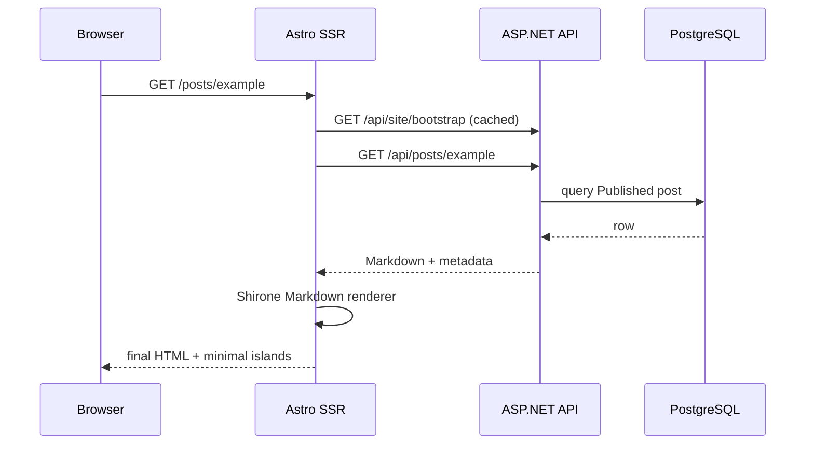

# Public Frontend Runtime

## Rendering model

Astro runs in SSR/server mode. The public site remains content-first and should hydrate only interactive Svelte islands.

High-level request flow:

## Bootstrap configuration

Astro should request the site bootstrap once per render context where possible. Backend should cache the typed settings object and emit cache validators.

Bootstrap data is a read model; it must not expose admin-only configuration such as DB credentials/password hash/storage internals.

## URL model

- Articles: `/posts/{slug}` only. Remove custom permalink templating.
- Slugs may contain Unicode.
- Custom Pages may contain nested path segments.
- Reserved system route names cannot be used for Custom Pages.

## Private posts

A Private article is accessible only if the request carries a valid admin authentication session. It is not merely “unlisted”.

Do not include Private/Draft metadata in:

- homepage
- archive
- taxonomy lists
- search
- RSS
- sitemap
- analytics

## Markdown

Canonical input is Markdown returned by API. Reuse the existing Shirone processor instead of implementing a second Markdown dialect in ASP.NET.

Keep security boundaries explicit: author is the administrator, but any raw-HTML Markdown capability should still be documented and handled consistently.

## Theme personalization

Remove public palette/layout/texture controls. Runtime source of appearance is bootstrap settings.

Keep only light/dark toggle. The default may be Light, Dark or System; browser choice is stored locally.

## Custom Page HTML/CSS

Custom Page HTML is administrator-authored but still processed according to the product policy: scripts are not supported. CSS should be scoped/contained where feasible.

Footer HTML is different: administrator scripts are explicitly permitted.

## API failures

Public pages should fail gracefully:

- bootstrap failure: render minimal defaults or a controlled error page; do not crash with raw stack traces
- missing post/page: 404
- backend unavailable: 5xx service error page

## Caching

Safe targets:

- site bootstrap: memory cache + ETag
- taxonomy summaries: short TTL
- published post reads: ETag/Last-Modified or short cache, invalidated naturally by update timestamps

Do not cache authenticated Private content into anonymous shared caches.
